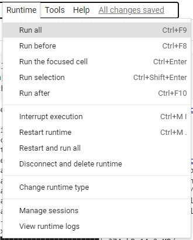
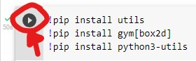
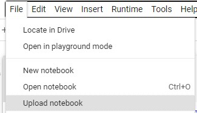
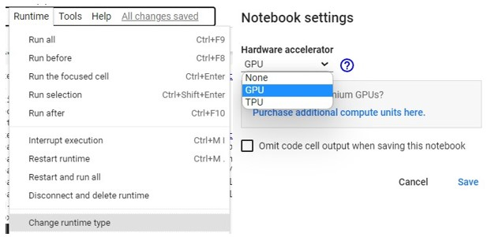

# RBE3043_20 - Nhóm12 & Lunar Lander game
## Overview
Trong đề tài này, mục tiêu của nhóm là hiểu ảnh hưởng của số điwn vị mạng Neural Network và các hyperparameters như discount rate, learning rate, decay đối với hiệu suất học tập của thuật toán thông qua tốc độ và độ ổn định.
## Introduction
### Partner
* Phạm Đăng Nguyên - 19020589_UET
* Phạm Hoàng Nghĩa - 19020589_UET
* Đàm Ngọc Phương - 19020595_UET
### Methods Used
* Q - Learning
* Deep Q - Learning (DQN)
* Neural Network
### Technologies
* Python
### Main python libraries
* gym
* torch
* matplotlib
* numpy
* Ipython
* glob
* collections
* base64, io
* random
## Code
### Requirements
* Sử dụng Google Colab với Python 3.8.16 (**IMPORTANT**)
* Should have GPU acceleration while training
* Link file requirements.txt đầy đủ cho thuật toán của nhóm: [LINK](https://drive.google.com/drive/u/0/folders/11lwCOnlYMnodPex17s9v3-Mw9y8Bx4uX)
### Using exist notebook
**Note**: Vào notebook public của nhóm thì có thể chạy trực tiếp bằng cách ấn vào 'Runall' trong mục 'Runtime' của Google Colab hoặc nếu muốn kiếm tra từng dòng code có thể ấn vào hình mũi tên bên trái mỗi dòng Code.

**Source Code Team trên Colab**: [LINK_SOURCE](https://colab.research.google.com/drive/1rMwt1EuThMYg2TboA8Fewq49xvIwqPdJ?usp=sharing)

* Chạy một lúc tất cả dòng code được minh họa: 
    
* Chạy từng dòng code để kiểm tra được minh họa: 
    
### Using new notebook
* Step 1: Tạo mới notebook
* Step 2: Trong notebook, chọn 'Upload notebook' để up file code
* Step 3: Upload file requirements.txt đối với từng model (Lấy ở phần requirement mà nhóm đã up ở trên) 
* Step 4: Chạy câu lệnh pip install -r "path-to-requirements.txt" ở phần Console để install các thư viện cần thiết.
* Step 5: Kiểm tra notebook đã chạy Python và cài đặt chạy bằng GPU chưa, với GPU thì có thể vào 'Runtime' chọn 'Change runtime type' rồi chọn GPU để bật
* Step 7: Dùng 'Runall' để chạy toàn bộ notebook hoặc có thể chạy từng câu lệnh để kiểm tra như được hướng dẫn bên trên.
# Kết quả thuật toán, con tàu đã hạ cánh đúng nơi quy định:
[https://user-images.githubusercontent.com/86046279/209752037-ea7ba392-b6ff-49f2-8f62-d4331c66ad35.mp4](https://user-images.githubusercontent.com/86046279/209752272-69a64209-e0eb-44ae-b570-c9d47948b241.mp4)
